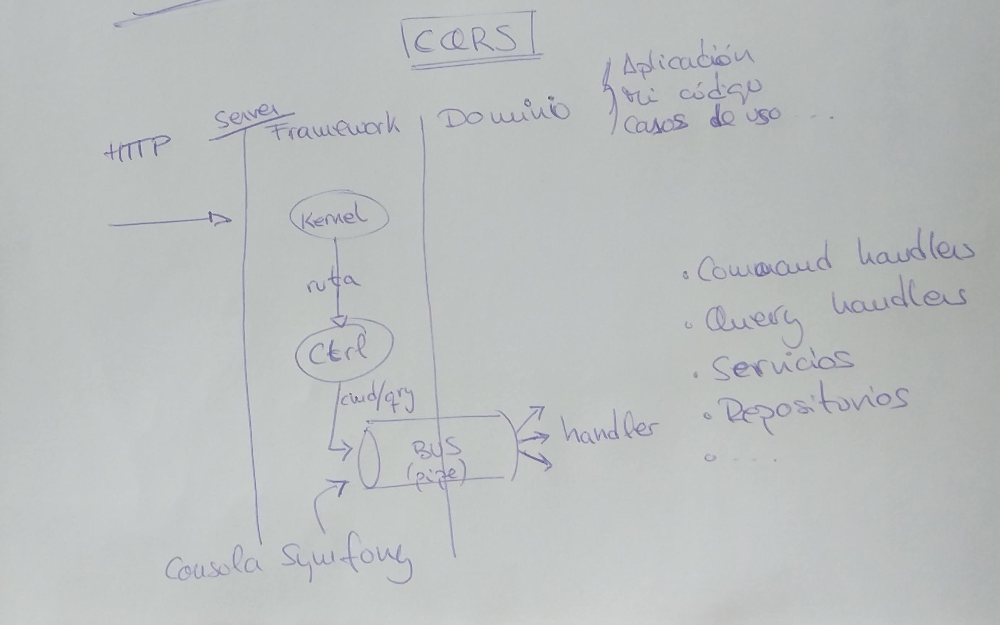

# Día 2

CQRS y nuestro primer caso de uso: get-user, buscar un usuario por su UID

## Notas tomadas

En lugar de hablar mucho sobre Docker, hemos estado hablando sobre CQRS y cómo
comenzar a trabajar con DriftPHP

Comenzamos clonando el proyecto [skeleton](https://github.com/driftphp/skeleton)

O también podemos comenzar creándolo con `composer`

```
composer create-project drfitphp/skeleton -sdev
```

Ese comando clona el proyecto e instala las dependencias. Aquí ya he comenzado
a tener problemas, que luego he conseguido solucionar trabajando de una forma
un poco diferente con Docker: 
[Problemas ejecutando DriftPHP en Windows](https://github.com/rchavarria/driftphp-skeleton/blob/master/docs/running-project-on-windows.md)

### CQRS

Es una arquitectura estructural, que te condiciona todo

Suele haber código más redundante, suele haber código igual, pero que no es el
mismo, por lo que no está totalmente duplicado, y no puedes hacer abstracciones

Te obliga a dividir tu API en endpoints de escritura (comandos) y de lectura
(queries)



Para pasar del framework al Dominio (o Aplicación casi, porque al final, tu
Aplicación es tuya, es tu Dominio), es a través de un pipe, a través del 
command-bus o del query-bus

Lo único que se inyecta en los controladores son esos buses, nada de inyectar
servicios

Al otro lado del pipe, en nuestro dominio, tendremos query y command handlers,
la única forma de entrar en nuestro dominio es a través de estos handler,
llamándolos con queries y comandos

Hay una relación 1 a 1, 1 comando => 1 command handler, no puede haber command
sin su handler

¿Qué diferencia hay entre un command-bus y event-bus? En un command-bus, debe de
haber una relación 1-1, en un event-bus, puede haber varios listeners para un único
evento

Cada caso de uso necesita:

- value object: los datos que necesita
- command/query

CQRS genera muchas más clases, pero ayuda mucho (y mucho) a testear los casos de
uso

Otra ventaja de usar estos buses es que tengo un único punto por donde pasan
todos los datos, todas las peticiones, todo. Estos buses son un punto muy
bueno para tener *middelwares* (autorización, logging,...)

Como los comandos no necesitan devolver repuestas, lo que puedes hacer es
encolarlos y terminar la petición, porque lo encolas y te olvidas

Ya vimos ayer que CQRS y promesas... ya no hace falta encolar porque ya no es
bloqueante...

El recurso más disputado en un thread de PHP es la CPU, si tenemos casos de uso
que son muy intensos en uso de CPU, podemos estar fastidiando a otros casos de 
uso, pero con CQRS podemos hacer que estos casos de uso sean asíncronos, que se
ejecuten a parte

## Práctica: añadir una ruta para buscar un usuario por su UID

Vamos a necesitar command y query bus en nuestro proyecto. Añadimos la dependencia
en `composer.json`:

```
"require": {
  "drift/command-bus-bundle": "*"
},
```

Activar el bundle. Para ello, hay que modificar el fichero de configuración
`/Drift/config/bundles.php`:

```
return [
  //...
  Drift\CommandBus\CommandBusBundle::class => [ 'all' => true ]
];
```

Como está activado el autowiring, ya podremos inyectar los buses en nuestros
controladores.

Podemos ver las clases que pueden ser inyectadas usando la consola de Symfony:

```
bin/console debug:container
```

Nuestro primer caso de uso, buscar un usuario por su UID.

Añadimos una nueva ruta en `/Drift/config/routes.yml`:

```
get_user:
  path: /users/{uid}
  controller: App\Controller\GetUserController
```

Añadimos el controlador en `src/Controller/GetUserController.php`, al cual le
inyectamos el query bus en el constructor:

```
public function __construct(QueryBus $bus) {
  $this->bus = $bus;
}
```

Necesitamos una query, y un query handler.

La query, `src/Domain/Query/GetUser.php` es simplemente una clase con los datos
que vamos a necesitar para buscar el usuario.

La query handler, `src/Domain/QueryHandler/GetUserHandler.php`, tiene un método
`handle`, que acepta una query `GetUser` y devolverá el usuario encontrado.
Por ahora, devolverá simplemente una estructura de datos muy básica.

En el controller, enviaremos la query a través del query bus, *preguntando* que
alguien la gestione y nos devuelva un resultado. Recuerda que todo es asíncrono,
y que debemos usar promesas. En `GetUserController`:

```
public function __invoke(Request $request) {
  $uid = $request->get('uid');

  return $this->bus
    ->ask(new GetUser($uid))
    ->then(function ($user) {
      return new JsonResponse($user, 200);
    });
}
```

1. Recupero el parámetro `uid`
2. A través del query bus, envío (`ask`) la query `GetUser`
3. El resultado es una promesa, que se resolverá con el resultado del query
handler
4. Una vez tengamos ese resultado, podremos generar la respuesta
3. El controller devuelve una cadena de promesas, que comienza con la promesa
devuelta por el query bus, y que vamos encadenando con otras promesas hasta que
la última se resolverá en una `Response`. 

Llegado a este punto, tengo una excepción, *no se encuentra el handler*.

```
[critical] Uncaught PHP Exception Drift\CommandBus\Exception\MissingHandlerException: "" at /var/www/vendor/drift/command-bus-bundle/Middleware/HandlerMiddleware.php line 63

500 GET    /users/1234 (341 ms | 21 MB) - 
```

Mirando la documentación de DriftPHP, en la parte de 
[cómo usar QueryBus](https://driftphp.io/#/?id=query-bus), parece ser que hay
que configurar el servicio, hay que indicar dónde están los handlers para el
query bus.

Modifico `/Drift/config/services.yml`:

```
services:
    _defaults:
        autowire: true
        autoconfigure: true
        public: true

    # Controllers
    # ...

    # Query handlers
    Domain\QueryHandler\:
        resource : "%app_path%/src/Domain/QueryHandler"
        tags:
            - 'query_handler'
```

Hay que tener cuidado con el namespace, `Domain\QueryHandler`, y la ruta del
`resource`.

Con todo esto, ejecuto el server y puedo hacer peticiones para buscar usuarios:

```
$ curl -s localhost:8000/users/1234
{"uid":"1234"}
$ curl -s localhost:8000/users/my-uid
{"uid":"my-uid"}
$ curl -s localhost:8000/users/ruben
{"uid":"ruben"}
```

## Preguntas

- `tactician` ¿para qué se usa? tactician-bundle,... parece que permite crear
buses, command-bus, query-bus,...

## Recursos

- Teoría similar a la de hoy: https://www.youtube.com/watch?v=3o9bOuJt56k
- Lista de vídeos sobre ReactPHP: https://www.youtube.com/playlist?list=PLKIEFFgNQYpVmUAKUjT_BRYYOdMHwGt0v
- [Fowler y CQRS](https://martinfowler.com/bliki/CQRS.html)
- [Mis problemas ejecutando DriftPHP en Windows](https://github.com/rchavarria/driftphp-skeleton/blob/master/docs/running-project-on-windows.md)
- [Cómo usar QueryBus en DriftPHP](https://driftphp.io/#/?id=query-bus)
- [Código de mi práctica](https://github.com/rchavarria/driftphp-skeleton/tree/get-user)
- [Proyecto skeleton de DriftPHP](https://github.com/driftphp/skeleton)
