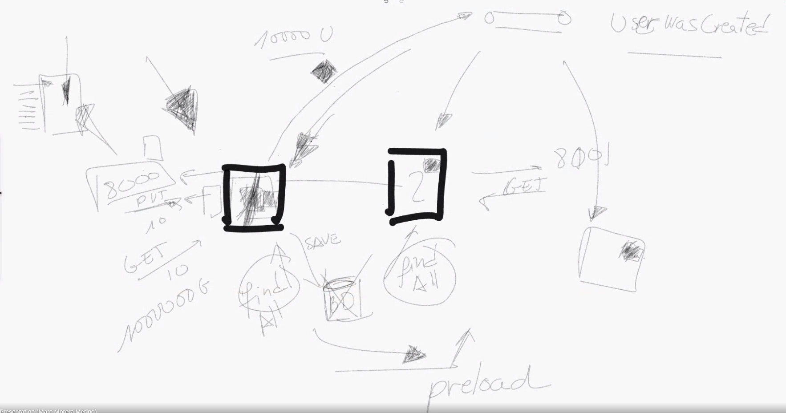

# Día 7

Vemos el uso de la herramienta `ab`, Apache Benchmark, para ver el rendimiento
de lo que estamos creando.

## Notas tomadas

Punto de partida:

- Servidor MySQL corriendo y con la tabla `users`
- Server corriendo, conectándose a MySQL a través de la conexión DBAL
- RabbitMQ corriendo, junto a MySQL, en un docker-compose

Vamos a ver la herramienta `ab`, Apache Benchmark

`ab` nos habla en percentiles:

- 10% tarda < 10s
- 80% tarda 20s
- El resto tarda 55555s

`ab -n 1000 -c 20 localhost:8000/users/10`

1000 peticiones, con una concurrencia de 20 (peticiones de 20 en 20)

Y la salida de `ab`:

```
Percentage of the requests served within a certain time (ms)
  50%    163
  66%    169
  75%    174
  80%    177
  90%    205
  95%    219
  98%    231
  99%    234
 100%    337 (longest request)
```

Cuando `ab` nos dice que hay mucha diferencia entre el percentil 50% y el 98%
99%, lo que significa es que hay algunas peticiones (pero pocas) que se quedan
muy bloqueadas por las peticiones que llegaron antes que ella. Lo cual significa
que lo que hay que hacer es escalar horizontalmente

### Event bus bundle

Una vez vista la herramienta del rendimiento, vamos a comenzar a emitir eventos

Añadir dependencia al `composer.json`

```
"drift/event-bus-bundle": "*"
```

Activar el bundle en `Drift/config/bundles.php`

```
Drift\EventBus\EventBusBundle::class => [ 'all' => true ]
```

Y configurarlo en `services.yml`

```
event_bus:
  exchanges:
    my_events: events_amqp
  router:
    _all: my_events
  async_pass_through: false
  async_adapter:
    adapter: amqp
    amqp:
      host: 192.168.1.143
```

`exchanges > my_events` y `router > _all > my_events` es necesario por ahora.
A Marc le costó un poco hacerlo funcionar, porque todo esto está evolucionando.

**Faltaría documentación sobre cómo configurar el event bus asíncrono con el
adaptador de AMQP**

### Eventos de Dominio

¿Qué es un evento de dominio? Es algo que ha ocurrido (ha ocurrido) en tu dominio,
en el pasado

Un comando/query es una acción que hay que hacer, viene de fuera y entra al
Dominio

Un evento, es algo que se genera dentro del Dominio, hacia afuera

Nota: PHP no permite la inmutabilidad, toma rant para PHP. Así que lo de que los
eventos sean inmutables... hay que tomarlo con delicadeza

¿Cómo tiene que ser un evento, un objeto? Sip, como un DTO, un objeto plano que
sea fácilemente serializable

Un ejemplo: `UserWasSaved`, no pondríamos `UserCreated` porque no se ha creado
el usuario realmente, el usuario nos lo han dado, el Dominio no lo ha hecho, lo
que hemos hecho ha sido guardarlo para más adelante

¿Dónde crear las clases? 

- `Domain\Model\User`: podría ser, pero no todos los eventos de Dominio van a 
ser del modelo, no todos van a estar relacionados con una entidad
- `Domain\Event`: estaría bien

¿Qué vamos a guardar en el evento `UserWasSaved`?

El propio `User`

¿Pero qué pasa si se lo vamos a mandar a otro lugar? ¿Qué pasa si el evento va a
una aplicación que no entiende de `User`? Si quieres poner la clase `User`
debes asumir que los clientes de este evento van a entenderlo.

O también, se pueden utilizar Transformers antes de que el evento salga del Dominio,
en el event bus, en RabbitMQ, antes de salir, transformaremos el objeto `User` en
un array o lo que sea

¿Quién lo lanza?

1. Controller: no es muy buen sitio, no es bueno añadir lógica al Controller, porque
esa lógica tendrá que estar duplicada en otros puntos de entrada al Dominio
2. Command handler: después de hacer el `save` del Repositorio, de esta forma, cuando
la promesa llegue al controller, habrán pasado 2 cosas:
    a. el usuario ha sido guardado en el repo
    b. el evento se ha lanzado

```
return $this
  ->userRepository
  ->save($putUser->getUser())
  ->then(function () use ($putUser) {
    return $this
      ->eventBus
      ->dispatch(new UserWasCreated($putUser->getUser()));
  });
```

Hay que inyectar el event bus en el command handler

```
public function __construct(
    UserRepository $userRepository,
    EventBus $eventBus
)
```

Hay que recordar hacer `return $this->eventBus->dispatch()` para que la cadena
de promesas funcione correctamente (tanto de promesas resolved, como rejected), es
importante tanto para devolver resultados como para gestionar los errores

¿Alguna utilidad para los eventos de dominio?

- Monitorizar y trazar de lo que pasa en el server
- Como en PHP todo es síncrono, tú no puedes dejar ciertas tareas para después,
como lanzar un correo, anotar esto en el log, guardar el estado para luego,...
**los eventos de Dominio nos dejan hacer estas tareas de forma asíncrona**
(este es un beneficio muy importante de los eventos, la capacidad de dejar
ciertas tareas para después, mientras termino de procesar la petición tan
rápido como me sea posible)

Por ahora, el event bus es algo interno al server, no usamos todavía nada de
RabbitMQ (adaptador AMQP), pero al menos, algo interno, tenemos un event bus,
para poder enviar eventos de forma asíncrona

RabbitMQ nos servirá para cuando tengamos que escalar horizontalmente, para comunicar
los distintos servidores. Un server mandará a RabbitMQ un evento de Dominio, y
todos los servers lo escucharán (incluso él mismo). Luego, cada server decidirá
si tiene que hacer algo con ellos o no

Otra utilidad de los eventos de dominio, que ha descubierto Marc, y que le ha
molado más de sus últimos 5 años de developer

Dos servers, escuchando eventos de Dominio, y cuando escucho un evento
`UserWasCreated`, mi repositorio hace un `findAll` y se hace una copia de todos
los usuarios en memoria. Esto está bien en ciertos casos:

- Pocos puts, pero muchos gets, es decir, pocas escrituras y muchas lecturas
- Tablas con filas limitadas (nada de tabla enoooormes)
- Muchos puts (escrituras), pocos gets (lecturas), no tiene sentido esta optimización

En DriftPHP existe algo, un evento `preload`, que es un evento del framework, y con
este evento podemos precargar ciertas tablas

Esto en DriftPHP y ReactPHP es posible hacerlo, porque puedes escuchar un puerto
HTTP y una cola RabbitMQ, cosa que con Symfony no puedes



## Deberes

## Referencias

**Faltaría documentación sobre cómo configurar el event bus asíncrono con el
adaptador de AMQP**
